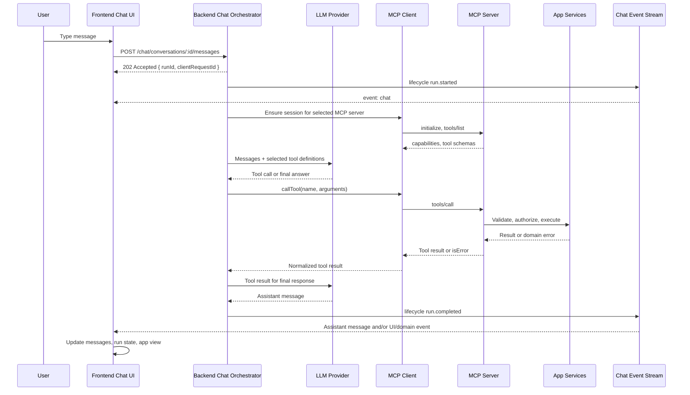

# MCP Chatbot Architecture And Transport Reference

## Table Of Contents

- Source baseline
- Role model
- Endpoint taxonomy
- Communication graph
- Lifecycle
- Chat event contract
- Transport decisions
- Security and privacy checklist

## Source Baseline

Use official MCP documentation as the authority.

- Specification: <https://modelcontextprotocol.io/specification>
- Architecture: <https://modelcontextprotocol.io/docs/learn/architecture>
- Transport reference:
  <https://modelcontextprotocol.io/specification/2025-11-25/basic/transports>
- Client guide: <https://modelcontextprotocol.io/docs/develop/build-client>
- Client best practices:
  <https://modelcontextprotocol.io/docs/develop/clients/client-best-practices>

Verified on 2026-05-18: the canonical specification URL redirects to
protocol version `2025-11-25`. The transport layer still centers on stdio and
Streamable HTTP, with legacy HTTP+SSE only for compatibility.

## Role Model

| Role | Owns | Does not own |
| --- | --- | --- |
| Chatbot UI | User input, message list, run status, local optimistic state, accessibility, consent notices. | MCP credentials, model provider secrets, business authorization. |
| Chatbot backend/orchestrator | Conversation persistence, run creation, LLM calls, MCP client sessions, permission checks, event publishing. | UI rendering details, MCP server domain logic. |
| MCP host | The overall AI app boundary: model context, user permissions, policy, MCP client registry. | Individual MCP server internals. |
| MCP client | One connection to one MCP server: initialize, discover, invoke, receive notifications, close. | Cross-server policy, UX, business logic. |
| MCP server | Tools, resources, prompts, validation, domain adapter. | Chat history, model selection, frontend state. |
| LLM provider | Text/tool-call generation for the chatbot loop. | MCP protocol state. |

In a web application, the backend usually acts as the MCP host. The browser UI
is the chat surface and event consumer. Direct browser MCP clients are possible
only when CORS, OAuth/user tokens, session headers, and data exposure have been
designed explicitly.

## Endpoint Taxonomy

### Product Chat API

These endpoints are application endpoints, not MCP transport endpoints.

| Endpoint | Method | Purpose | Notes |
| --- | --- | --- | --- |
| `/chat/status` | `GET` | Feature availability. | Useful for disabled deployments or feature flags. |
| `/chat/conversations` | `POST` | Create a conversation. | Accept optional title/context such as active workspace. |
| `/chat/conversations` | `GET` | List user conversations. | Paginate and filter by authenticated subject. |
| `/chat/conversations/{id}/messages` | `POST` | Submit a user message. | Return `202 Accepted` plus `runId`; execute async. |
| `/chat/conversations/{id}/messages` | `GET` | Read message history. | Cursor pagination; preserve chronological rendering client-side. |
| `/chat/conversations/{id}` | `DELETE` | Delete/soft-delete conversation. | Useful for privacy and retention workflows. |
| `/chat/export` | `GET` | Export user chat data. | Include only data the user may receive. |
| `/chat/runs/{runId}/steps` | `GET` | Optional debug/admin trace. | Protect with admin or owner-only policy. |

### Chat Streaming API

Use one of these to push run state back to the frontend:

| Endpoint | Transport | Purpose |
| --- | --- | --- |
| `/notifications/stream` | SSE | Shared app event stream carrying `event: chat` envelopes. |
| `/chat/runs/{runId}/events` | SSE | Run-scoped stream when one stream per run is simpler. |
| `/chat/ws` | WebSocket | Bidirectional UI channel when the app already standardizes on WS. |

Recommended event classes:

- `lifecycle`: run started, step/progress, completed, failed.
- `ui`: commands the frontend may apply, such as navigate, focus, highlight.
- `domain`: data changed because a tool mutated application state.

### MCP Transport API

These endpoints are for MCP JSON-RPC communication between MCP client and MCP
server.

| Transport | Shape | Use |
| --- | --- | --- |
| stdio | No HTTP endpoint; host launches a process and exchanges JSON-RPC over stdin/stdout. | Local CLI/desktop/server-side sidecar tools. |
| Streamable HTTP | Usually one path such as `POST /mcp`, `GET /mcp` for SSE or `405`, optional `DELETE /mcp`. | Remote or embedded MCP servers. |
| In-process/custom | No public endpoint; linked transports inside one runtime. | Backend chat bridge to an internal MCP server without HTTP overhead. |
| Legacy HTTP+SSE | `GET /sse` plus `POST /messages` or SDK-specific equivalent. | Backward compatibility only. |

Do not create one HTTP route per MCP tool. MCP tool calls are JSON-RPC
`tools/call` messages carried through the selected transport.

### MCP JSON-RPC Methods

| Area | Common methods | Chatbot spec questions |
| --- | --- | --- |
| Initialization | `initialize`, `notifications/initialized` | Which protocol version, client info, and capabilities are declared? |
| Tools | `tools/list`, `tools/call`, `notifications/tools/list_changed` | Which tool definitions enter the model context, when, and under which permissions? |
| Resources | `resources/list`, `resources/read`, `resources/subscribe` | Which read-only context can the chatbot fetch? |
| Prompts | `prompts/list`, `prompts/get` | Are server-provided prompt templates used in the chatbot? |
| Client features | sampling, elicitation, roots, logging | Can the server ask the chatbot host to sample, ask the user, or expose roots? |
| Utilities | `ping`, cancellation, progress, logging notifications | How are liveness, cancellation, and progress surfaced? |

## Communication Graph



## Lifecycle

1. UI creates or selects a conversation.
2. UI submits a message with an idempotency key such as `clientRequestId`.
3. Backend persists the user message and creates a run.
4. Backend publishes `run.started`.
5. Backend opens or reuses MCP client sessions needed for the run.
6. MCP client initializes and discovers capabilities.
7. Backend selects tool definitions for the model, preferably with progressive
   discovery when tool catalogs are large.
8. Model returns tool calls or a final answer.
9. Backend routes tool calls through MCP clients and records tool results.
10. Backend emits lifecycle, UI, and domain events in sequence order.
11. Backend persists the assistant answer and completes or fails the run.
12. UI reconciles optimistic messages with persisted messages and stream events.
13. Backend closes per-run MCP sessions or returns reusable sessions to a pool.

## Chat Event Contract

Use ordered envelopes so the frontend can deduplicate, buffer, and replay.

```json
{
  "v": 1,
  "eventId": "evt_...",
  "runId": "run_...",
  "conversationId": "conv_...",
  "clientRequestId": "client_...",
  "sequence": 3,
  "kind": "lifecycle",
  "type": "run.step",
  "timestamp": "2026-05-18T10:00:00.000Z",
  "payload": { "label": "Calling calendar_search_events" }
}
```

Guidelines:

- Increment `sequence` per run.
- Include `conversationId` and `clientRequestId` to ignore stale events.
- Keep `type` stable and namespaced: `run.*`, `ui.*`, `domain.*`.
- Treat malformed event payloads as non-fatal UI errors.
- Use heartbeat events for long-lived SSE connections.

## Transport Decisions

| Question | Prefer |
| --- | --- |
| Is the MCP server local and launched by the host? | stdio |
| Is the MCP server remote or embedded behind HTTP? | Streamable HTTP |
| Is the MCP server internal to the same backend process? | In-process/custom transport |
| Must old clients connect? | Add legacy SSE compatibility explicitly |
| Does the browser connect directly to MCP? | Streamable HTTP with strict CORS, exposed `MCP-Session-Id`, and OAuth/user auth |
| Does the chat UI only need run updates? | Product SSE/WebSocket, not MCP transport |

## Security And Privacy Checklist

- Keep LLM and MCP credentials backend-side unless direct browser MCP is
  explicitly approved.
- Authenticate chat REST, streaming, and MCP endpoints independently.
- Authorize per conversation, per run, and per MCP tool/resource/prompt.
- Validate `Origin` and `Host` for remote HTTP MCP endpoints.
- For Streamable HTTP, document session id behavior and expose session headers
  only to trusted browser origins.
- Enforce request limits, timeouts, cancellation, and rate limits.
- Require human confirmation or explicit policy for destructive tools.
- Treat MCP tool outputs as untrusted input before passing them to the model or
  another tool.
- Log method/tool names, subject, run id, session id, duration, status, and
  error category. Avoid raw secret or full prompt logging by default.
- Document retention, export, deletion, and analytics opt-out behavior for
  chat history and traces.
