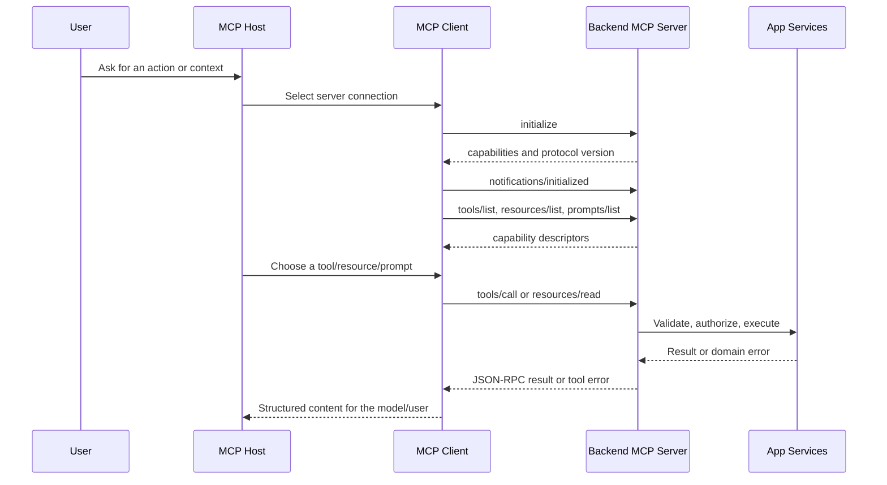

# MCP Server Backend

## Purpose

Use this skill to draft a clear, human-readable specification for adding an MCP
server to an existing backend application. Keep the core guidance agnostic:
focus on transport, communication, endpoint shape, protocol lifecycle, and the
boundary between the MCP adapter and the application domain.

Move framework-specific details to `resources/`:

- Read `resources/protocol-transport.md` for endpoint types, lifecycle,
  communication graphs, headers, sessions, and method catalog.
- Read `resources/spec-template.md` when producing a full specification.
- Read `resources/python-fastmcp.md` for Python/FastMCP implementation examples.
- Read `resources/typescript-nestjs.md` for TypeScript/NestJS examples.

## Source Baseline

Use official MCP documentation as the source of truth. Current verified baseline:
MCP protocol version `2025-11-25`.

- Specification: <https://modelcontextprotocol.io/specification/2025-11-25>
- Transports: <https://modelcontextprotocol.io/specification/2025-11-25/basic/transports>
- Architecture: <https://modelcontextprotocol.io/docs/learn/architecture>
- Python SDK: <https://github.com/modelcontextprotocol/python-sdk>
- TypeScript SDK: <https://github.com/modelcontextprotocol/typescript-sdk>

If the implementation depends on exact SDK APIs, verify the installed SDK
version before writing code. Use the protocol concepts here even when SDK helper
names differ.

## Workflow

1. Identify the existing backend runtime, HTTP adapter, deployment topology,
   authentication model, and target MCP clients.
2. Choose the transport:
   - `stdio` for local process-based tools launched by an MCP host.
   - `Streamable HTTP` for remote or embedded HTTP backends.
   - Legacy HTTP+SSE only for old clients that cannot use Streamable HTTP.
3. Define the transport endpoint contract before defining tools:
   path, HTTP methods, headers, session behavior, auth, CORS, error responses,
   and streaming behavior.
4. Map application capabilities to MCP primitives:
   tools for actions, resources for readable context, prompts for reusable
   interaction templates, and roots/sampling/elicitation only when needed.
5. Draw the communication path from MCP host to MCP client to backend MCP server
   to domain services.
6. Specify schemas, validation, authorization, rate limits, logging, metrics,
   test cases, and rollout strategy.

## Roles

| Role | Responsibility | In a backend integration |
| --- | --- | --- |
| MCP host | User-facing application that coordinates MCP clients, for example an IDE or assistant app. | Owns UX, model context, permissions prompts, and client lifecycle. |
| MCP client | Protocol client created by the host for one server connection. | Sends `initialize`, lists capabilities, calls tools, reads resources, receives notifications. |
| MCP server | Backend-side protocol server exposing capabilities over a transport. | Translates MCP JSON-RPC requests into application service calls and returns typed results. |
| Application services | Existing domain/application layer. | Remains protocol-agnostic and receives validated, authorized calls from the MCP adapter. |

## Endpoint Types

Treat MCP "endpoints" as transport endpoints plus JSON-RPC methods, not as a
REST resource model.

| Endpoint type | Shape | Use |
| --- | --- | --- |
| stdio transport | No HTTP endpoint. The host launches a process and exchanges JSON-RPC over stdin/stdout. | Local CLI-style servers and ephemeral tools. |
| Streamable HTTP MCP endpoint | Usually one path such as `POST /mcp`, optional `GET /mcp`, optional `DELETE /mcp`. | Modern remote or embedded backend MCP servers. |
| Legacy HTTP+SSE | `GET /sse` plus `POST /messages` or similar SDK-specific paths. | Backward compatibility only. |
| Supporting backend endpoints | `/health`, `/ready`, auth metadata, metrics, admin routes. | Operational endpoints outside the MCP protocol. |
| JSON-RPC methods | `initialize`, `tools/list`, `tools/call`, `resources/read`, `prompts/get`, etc. | Protocol operations carried inside the transport endpoint. |

## Communication Graph

## Specification Output

When asked to create a specification, produce these sections:

1. Context and goals
2. Participants and responsibilities
3. Transport decision and endpoint contract
4. Capability model: tools, resources, prompts, optional client features
5. JSON-RPC lifecycle and communication graph
6. Authentication, authorization, CORS, and network security
7. Session, streaming, cancellation, progress, and error behavior
8. Observability, audit, rate limiting, and operations
9. Test strategy and acceptance criteria
10. Rollout, compatibility, and migration plan

Use `resources/spec-template.md` for the full fill-in template.

## Design Guardrails

- Keep the MCP layer thin. It should adapt protocol messages to use cases, not
  contain business logic.
- Model tools as user-intent operations, not one-to-one REST endpoint wrappers.
- Keep resources read-oriented and predictable. Use tools for mutation.
- Validate every tool input with an explicit schema and return structured errors.
- Never leak secrets, tokens, raw credentials, or unrestricted file/system access.
- Apply the same authorization policy as the backend API, with MCP-specific
  scopes when needed.
- For stdio servers, never write logs to stdout. Reserve stdout for protocol
  messages and send logs to stderr.
- For HTTP servers, validate `Origin` and `Host`, require authentication when
  remote, and expose only the headers clients need.
