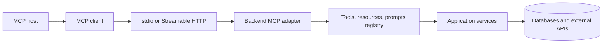
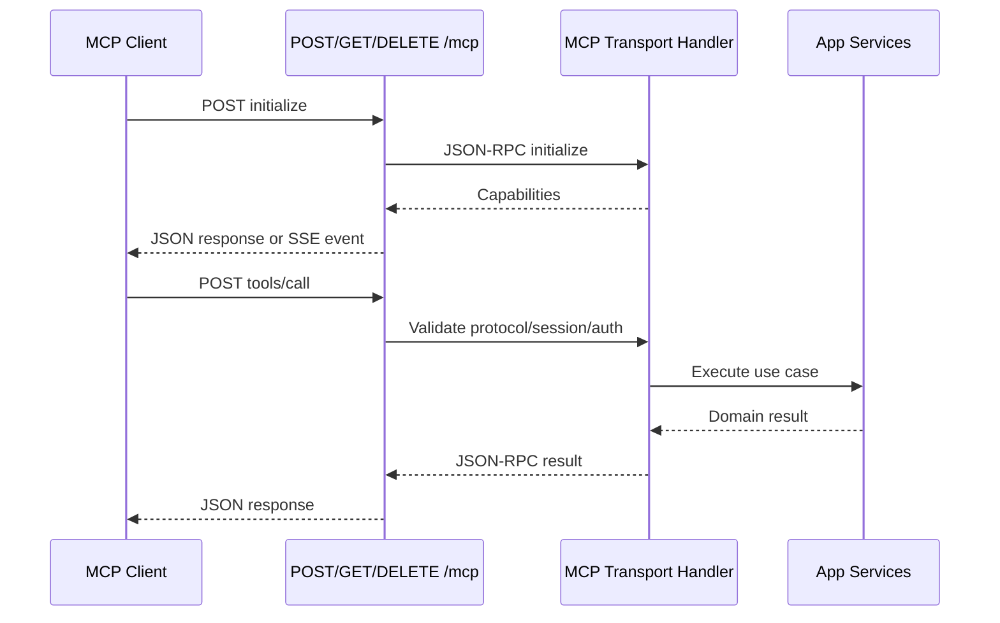

# MCP Protocol And Transport Reference

## Table Of Contents

- Source baseline
- Endpoint taxonomy
- Streamable HTTP endpoint contract
- Headers
- Lifecycle
- Method catalog
- Communication graphs
- Security checklist

## Source Baseline

Use the official MCP specification as the authority. This reference is based on
protocol version `2025-11-25`.

- Specification: <https://modelcontextprotocol.io/specification/2025-11-25>
- Transports: <https://modelcontextprotocol.io/specification/2025-11-25/basic/transports>
- Architecture: <https://modelcontextprotocol.io/docs/learn/architecture>
- Tools: <https://modelcontextprotocol.io/docs/learn/server-concepts#tools>
- Resources: <https://modelcontextprotocol.io/docs/learn/server-concepts#resources>
- Prompts: <https://modelcontextprotocol.io/docs/learn/server-concepts#prompts>

## Endpoint Taxonomy

| Category | Endpoint | Direction | Notes |
| --- | --- | --- | --- |
| stdio | Process stdin/stdout | Bidirectional | No HTTP path. The MCP host starts the server process. stdout is protocol-only; logs go to stderr. |
| Streamable HTTP | `POST /mcp` | Client to server | Carries JSON-RPC requests, notifications, and responses. Can respond with JSON or SSE. |
| Streamable HTTP | `GET /mcp` | Server to client | Optional SSE stream for server-initiated messages. Return `405 Method Not Allowed` if unsupported. |
| Streamable HTTP | `DELETE /mcp` | Client to server | Optional explicit session termination. Return `405 Method Not Allowed` if unsupported. |
| Legacy HTTP+SSE | `GET /sse` and `POST /messages` | Split stream and send endpoints | Deprecated for modern clients. Specify only for backward compatibility. |
| Ops/support | `/health`, `/ready`, `/metrics`, auth metadata | Non-MCP | Useful for deployment and observability but not part of the protocol. |

Do not design one HTTP route per MCP tool. MCP tools, resources, prompts, and
utility operations are JSON-RPC methods carried through the transport endpoint.

## Streamable HTTP Endpoint Contract

Recommended default path: `/mcp`.

| Method | Required | Request body | Typical response |
| --- | --- | --- | --- |
| `POST /mcp` | Yes | JSON-RPC request, notification, response, or batch | `application/json`, `text/event-stream`, or `202 Accepted` for notifications/responses. |
| `GET /mcp` | Optional | None | `text/event-stream` for server-initiated messages, or `405`. |
| `DELETE /mcp` | Optional | None | Session termination response, or `405`. |

For embedded backend apps, make the application router forward `GET`, `POST`,
and `DELETE` for the same path to the MCP transport handler. Keep body parsing,
auth guards, CORS, and request size limits explicit.

## Headers

| Header | Direction | Purpose |
| --- | --- | --- |
| `Content-Type: application/json` | Client to server | Required for JSON-RPC HTTP bodies. |
| `Accept: application/json, text/event-stream` | Client to server | Allows JSON responses and SSE streams. |
| `MCP-Protocol-Version` | Both | Version negotiation after initialization. |
| `MCP-Session-Id` | Both | Session correlation for stateful Streamable HTTP servers. |
| `Last-Event-ID` | Client to server | Optional resumability for SSE event replay. |
| `Authorization` | Client to server | Bearer token or other configured auth for remote servers. |
| `Origin` and `Host` | Client to server | Validate to prevent cross-origin and DNS rebinding attacks. |

For browser-accessed HTTP MCP servers, expose `MCP-Session-Id` in CORS responses
when stateful sessions are used.

## Lifecycle

1. Client sends `initialize` with supported protocol versions and capabilities.
2. Server responds with selected protocol version, server info, instructions,
   and server capabilities.
3. Client sends `notifications/initialized`.
4. Client discovers capabilities with methods such as `tools/list`,
   `resources/list`, and `prompts/list`.
5. Client invokes capabilities with methods such as `tools/call`,
   `resources/read`, and `prompts/get`.
6. Server may emit notifications for changes, progress, logging, or cancellation
   depending on declared capabilities.
7. Client or transport closes the session.

## Method Catalog

| Area | Common methods | Backend spec questions |
| --- | --- | --- |
| Initialization | `initialize`, `notifications/initialized` | What protocol version, server name, instructions, and capabilities are declared? |
| Tools | `tools/list`, `tools/call`, `notifications/tools/list_changed` | Which actions are exposed? What input schema and authorization apply? |
| Resources | `resources/list`, `resources/read`, `resources/templates/list`, `resources/subscribe`, `resources/unsubscribe`, `notifications/resources/list_changed`, `notifications/resources/updated` | Which read-only context is exposed? Are subscriptions supported? |
| Prompts | `prompts/list`, `prompts/get`, `notifications/prompts/list_changed` | Which reusable prompt templates are exposed? What arguments are required? |
| Completion | `completion/complete` | Are prompt/resource argument completions provided? |
| Utilities | `ping`, cancellation notifications, progress notifications, logging notifications | How are liveness, long-running calls, cancellation, and logs handled? |
| Client features | roots, sampling, elicitation | Does the server need the client to provide filesystem roots, LLM sampling, or user input? |

## Communication Graphs

### Transport Boundary

### Streamable HTTP Sequence

## Security Checklist

- Require authentication for every remotely reachable MCP endpoint unless the
  deployment is explicitly private.
- Validate `Origin` and `Host` for Streamable HTTP.
- Restrict accepted methods to `GET`, `POST`, and optional `DELETE` on the MCP
  path.
- Apply authorization per tool/resource/prompt, not only per endpoint.
- Enforce request size limits and timeouts.
- Log method name, capability name, subject, correlation/session id, duration,
  and outcome. Do not log secrets or full payloads by default.
- Rate-limit tool calls that trigger expensive operations or external APIs.
- Treat tool input as untrusted data even when called by an AI client.
