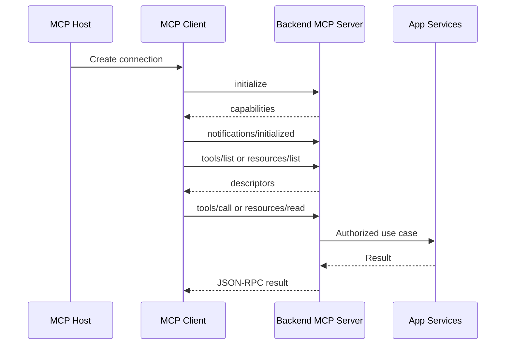

# Backend MCP Server Specification Template

Use this template when the output requested by the user is a specification, plan,
or design document for adding an MCP server to an existing backend.

## 1. Context And Goals

- Existing backend:
- Runtime and framework:
- Deployment target:
- Intended MCP clients:
- User workflows to support:
- Non-goals:

## 2. Participants And Responsibilities

| Participant | Responsibility | Owner |
| --- | --- | --- |
| MCP host | User-facing app that owns UX and creates MCP clients. | |
| MCP client | Protocol client connection to this server. | |
| MCP server | Backend adapter exposing MCP capabilities. | |
| Application services | Existing domain/application logic called by MCP handlers. | |
| Identity provider | Auth/token/session authority. | |

## 3. Transport Decision

Chosen transport:

- `stdio`
- `Streamable HTTP`
- Legacy HTTP+SSE compatibility

Decision rationale:

- Local vs remote:
- Expected clients:
- Streaming needs:
- Session needs:
- Deployment constraints:

## 4. Endpoint Contract

### stdio

- Launch command:
- Environment variables:
- Working directory:
- stdout policy: protocol messages only
- stderr policy: logs and diagnostics

### Streamable HTTP

- Base URL:
- MCP path: `/mcp`
- Supported methods: `POST`, optional `GET`, optional `DELETE`
- Required headers:
- Response modes: JSON, SSE, `202 Accepted`
- Session mode: stateless or stateful
- CORS policy:
- Auth policy:
- Request size and timeout:
- Health/readiness endpoints:

## 5. JSON-RPC Lifecycle

Document the expected sequence:

1. `initialize`
2. `notifications/initialized`
3. capability discovery
4. capability invocation
5. notifications/progress/cancellation
6. shutdown/session close

Include a communication graph:

## 6. Capability Matrix

### Tools

| Name | Intent | Input schema | Output shape | Authorization | Side effects | Errors |
| --- | --- | --- | --- | --- | --- | --- |
| | | | | | | |

### Resources

| URI or template | Description | MIME type | Authorization | Cache/subscription policy |
| --- | --- | --- | --- | --- |
| | | | | |

### Prompts

| Name | Purpose | Arguments | Returned messages | Authorization |
| --- | --- | --- | --- | --- |
| | | | | |

### Optional Client Features

- Roots:
- Sampling:
- Elicitation:
- Completion:

## 7. Security And Permissions

- Authentication mechanism:
- Authorization model:
- MCP-specific scopes or roles:
- Origin and Host validation:
- Secret handling:
- Data exposure rules:
- Audit events:
- Abuse controls and rate limits:

## 8. Error, Cancellation, And Progress Behavior

- JSON-RPC errors:
- Tool-level errors:
- Validation errors:
- Domain errors:
- Timeouts:
- Cancellation:
- Progress notifications:
- Retry/resume policy:

## 9. Observability

- Logs:
- Metrics:
- Traces:
- Correlation and session ids:
- Audit trail:
- Alerts:

## 10. Tests And Acceptance Criteria

- Unit tests for capability registration and schemas.
- Integration tests for `initialize`, discovery, and one successful tool call.
- Security tests for missing auth, invalid role/scope, invalid Origin/Host.
- Contract tests for JSON-RPC error shapes.
- Streaming tests if `GET /mcp` or SSE responses are enabled.
- Regression tests for business use cases called through MCP.

Acceptance criteria:

- The MCP client can initialize and discover declared capabilities.
- Every exposed capability has schema, authorization, tests, and documented errors.
- Unsupported methods return the documented response.
- Logs and metrics identify capability name, subject, duration, and outcome.
- No secret or restricted data is returned to the client.

## 11. Rollout And Compatibility

- Feature flag:
- Environment enablement:
- Backward compatibility with legacy clients:
- Versioning policy:
- Migration plan:
- Operational runbook:
- Decommission plan:
