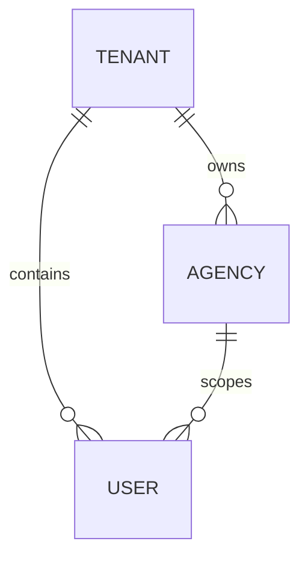

# Model Tenant Agency User DB

## Purpose

Use this skill to design a tenant/agency/user model before implementation.
Make the ownership, cardinalities, and lifecycle rules explicit enough that SQL,
ORM models, access control, and RLS policies cannot drift from the domain.

For a complete PostgreSQL example with RLS policies, read
`references/tenant-agency-user-postgres.sql`.
To verify the example on PostgreSQL, load
`references/tenant-agency-user-rls-smoke.sql` after the schema.

## Default Model

Model three core entities:

- `Tenant`: customer organization or legal/business account using the platform.
- `Agency`: operational branch or real-estate agency attached to exactly one tenant.
- `User`: human account attached to exactly one tenant and either zero or one agency.

Use these role rules unless the user says otherwise:

- `admin_tenant`: belongs to one tenant and no agency.
- `admin_agency`: belongs to one tenant and exactly one agency of that tenant.
- `user`: belongs to one tenant and exactly one agency of that tenant.

Do not model agency membership as optional for all roles just because tenant
admins have no agency. Put the exception in a check constraint or equivalent
domain rule.

## MCD Shape

Start with the conceptual shape before SQL:

State the cardinalities in prose:

- A tenant has zero or many agencies.
- An agency belongs to exactly one tenant.
- A user belongs to exactly one tenant.
- A user belongs to zero or one agency, but only `admin_tenant` may have no agency.
- An agency-scoped business record must carry both `tenant_id` and `agency_id`
  when ordinary agency authorization is required.

## Design Workflow

1. Identify whether each business resource is tenant-scoped, agency-scoped, or
   global/reference data.
2. Write the MCD with tenant and agency ownership visible; avoid hiding the
   scope only in prose.
3. Define the role matrix: who can read, write, administer, and invite users.
4. Define SQL constraints: foreign keys, unique indexes, role checks, and
   cross-tenant prevention.
5. Define RLS policies from the same rules. Prefer database isolation over
   application-only filters.
6. Decide deletion behavior table by table. Ask the user when lifecycle
   causality is ambiguous.

## RLS Principles

Use session settings or equivalent trusted connection context to expose the
current `tenant_id` and `user_id` to PostgreSQL policies.

Require every tenant-owned table to include `tenant_id`. For agency-owned
tables, include both `tenant_id` and `agency_id`; do not infer tenant only via
joins when the row itself needs tenant isolation.

Apply the role rules consistently:

- Tenant admins may access all tenant rows.
- Agency admins may access rows for their own agency.
- Simple users may access rows for their own agency, with write permissions
  narrowed by the domain.

## Delete And Retention Rules

Never default to cascade delete from tenant or agency for records whose
existence may be legally, financially, or operationally independent.

Use `ON DELETE RESTRICT` or archival/status fields for domains such as billing,
invoices, payments, accounting exports, audit logs, documents with legal value,
and contractual history.

Use `ON DELETE CASCADE` only when the child row has no independent meaning
without the parent, such as ephemeral preferences, invitation tokens, draft UI
state, or purely technical join rows.

When the causal ownership is unclear, stop and ask the user. Good clarification
questions:

- Must this data survive after a tenant leaves the platform?
- Is this row evidence of a legal, financial, audit, or customer-support event?
- Is deletion expected to erase data, deactivate access, anonymize personal
  data, or close the business account?
- Can an agency be closed while historical records remain attached to it?

## Output Checklist

When using this skill, include:

- A focused MCD or ERD with tenant, agency, user, and the changed business rows.
- Cardinalities and role constraints in plain language.
- SQL-level constraints or migration notes.
- RLS assumptions and policy outline.
- Explicit delete/retention choices, with open questions where causality is
  ambiguous.
