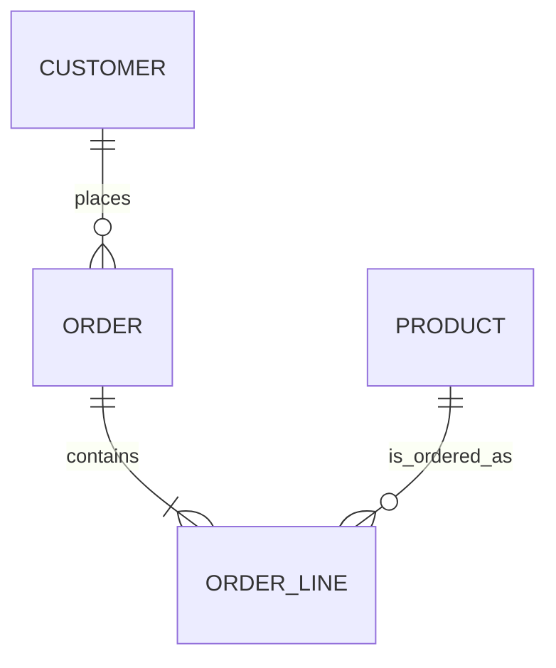

# Speckit Data MCD

## Overview

Use this skill to make data changes legible before they become database work.
Treat the MCD as the shared contract between the human and the AI: it is used
to clarify intent, expose ambiguity, and report the exact conceptual impact of
database changes.

For notation details, examples, and Docker commands, read
`references/mcd-markdown-terminal.md`.

## Communication Protocol

1. Identify the data surface: entities, relationships, cardinalities,
   identifiers, lifecycle rules, ownership, privacy constraints, and expected
   queries.
2. Separate conceptual intent from physical implementation. Describe business
   objects first; mention tables, columns, indexes, and migrations only after
   the conceptual model is understood.
3. When the request is underspecified, show a provisional MCD of the current
   interpretation before asking questions. Put uncertainty directly in the
   diagram labels or immediately below it.
4. During specification, include an MCD section in the Speckit output whenever
   persistent data changes are in scope.
5. During implementation reports or migration summaries, include two focused
   MCD diagrams: `Before` and `After`. Explain only the conceptual delta visible
   between them.

## Diagram Rules

- Prefer `mocodo` blocks for true Merise MCD work: associations are first-class,
  cardinalities use `0N`, `11`, `1N`, and the source can be rendered or converted
  to Mermaid.
- Prefer `mermaid` `erDiagram` blocks when the output must live directly in
  Markdown, GitHub issues, pull requests, or Speckit artifacts.
- Keep diagrams focused on the changed neighborhood. Include unchanged entities
  only when they explain the change. Aim for 3-7 boxes; split larger domains.
- Use singular entity names. Name relationships with domain verbs, not foreign
  key mechanics.
- Show only attributes that help the human validate meaning: identifiers,
  newly added/removed fields, relationship-bearing fields, sensitive fields, or
  attributes with important constraints.
- Avoid presenting a physical schema as an MCD without saying so. If only SQL is
  known, label the diagram as "logical approximation from current schema".

## Speckit Specify Output

When drafting or improving a `/speckit.specify` prompt for data work, include:

1. Context: what business process or user story creates the data need.
2. MCD: a focused conceptual diagram of the target model, plus unresolved
   variants if the human must choose.
3. Data rules: cardinalities, uniqueness, ownership, deletion behavior,
   lifecycle transitions, retention, privacy, and audit needs.
4. Acceptance criteria: observable behavior that proves the data model supports
   the feature.
5. Out of scope: physical optimizations, unrelated tables, historical cleanup,
   or reporting dimensions that the request does not need.

## Clarification Pattern

When information is unclear, answer with this shape:

````markdown
I understand the data model like this:



Open points before I write the spec:
- Can an order exist without at least one line?
- Is product price copied to the order line at purchase time?
````

Do not hide ambiguity in prose only. Put the tentative model in front of the
human so they can correct the shape, not just the wording.

## Change Report Pattern

When reporting a database change, always include:

1. `Before` MCD: only the affected conceptual neighborhood before the change.
2. `After` MCD: the same neighborhood after the change.
3. Delta notes: added/removed entities, changed cardinalities, new invariants,
   migration/backfill concerns, and user-visible consequences.
4. Validation: how the change was checked, including migration tests or schema
   diff commands when available.

Use paired diagrams even for small changes if the database shape changed. For
pure index/performance changes with no conceptual impact, state that the MCD is
unchanged and show the relevant physical diff instead.

## Tooling

Use the bundled Dockerfile when Mocodo is useful:

```bash
docker build -t speckit-data-mcd-mocodo skills/speckit-data-mcd
docker run --rm -u "$(id -u):$(id -g)" -v "$PWD:/work" speckit-data-mcd-mocodo --input path/to/model.mcd
```

Use Mermaid directly in Markdown when rendering is not required locally. Use
Mermaid CLI only when an SVG/PNG artifact is needed.
