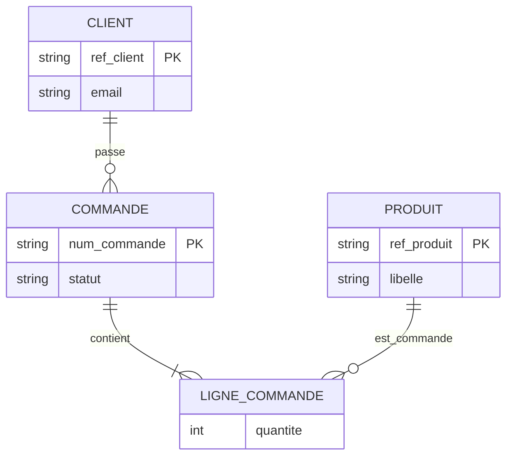
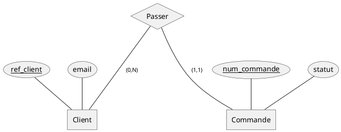
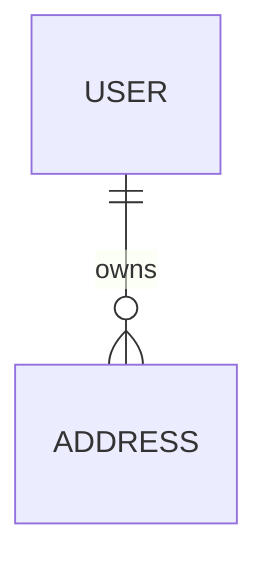
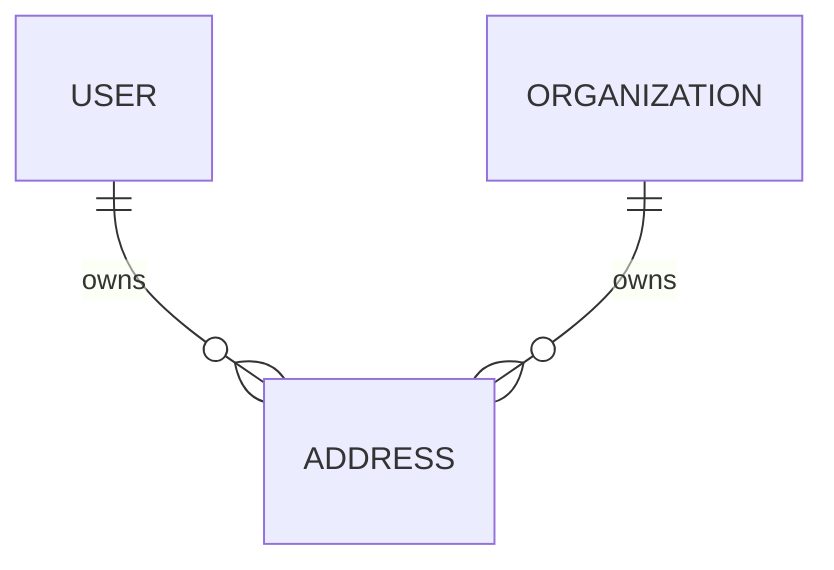

# MCD Markdown And Terminal Notation

## Table of Contents

- Decision
- Source Baseline
- Mocodo For True MCD
- Mermaid For Markdown
- PlantUML When Already Adopted
- Before/After Template
- Docker Commands

## Decision

Use two text formats:

| Need | Format | Why |
| --- | --- | --- |
| True French/Merise MCD with first-class associations | Mocodo | Dedicated MCD DSL, CLI, open source, can generate diagram, MLD, DDL, and Mermaid crow's-foot output. |
| Markdown-native diagrams in Speckit docs, GitHub, PRs, issues | Mermaid `erDiagram` | Portable fenced Markdown, readable in terminal, widely rendered by documentation tools. |
| Project already uses PlantUML or needs Chen notation | PlantUML | Supports conceptual ER/Chen diagrams and information-engineering crow's-foot notation. |

Default to Mermaid in Speckit artifacts unless the human explicitly wants a
Merise MCD, the domain has complex associations, or Mocodo rendering/conversion
is useful.

## Source Baseline

- Mocodo: <https://www.mocodo.net/> and <https://github.com/laowantong/mocodo>
  describe an open-source command-line tool that takes an MCD in a minimalist
  DSL and outputs entity-association diagrams, MLD, DDL, UML, and other forms.
- Mocodo documentation: <https://laowantong.github.io/mocodo/> shows conversion
  from Mocodo MCD to Mermaid crow's-foot syntax with `-t crow:mmd`.
- Mermaid ER: <https://mermaid.js.org/syntax/entityRelationshipDiagram.html>
  documents Markdown-friendly ER diagrams, crow's-foot cardinalities, typed
  attributes, and relationship labels.
- Mermaid CLI: <https://github.com/mermaid-js/mermaid-cli> renders Mermaid
  definitions to SVG/PNG/PDF and provides Docker usage.
- PlantUML ER/Chen: <https://plantuml.com/er-diagram> documents conceptual ER
  diagrams with entities, attributes, relationships, and structural constraints.
- PlantUML IE: <https://plantuml.com/en/ie-diagram> documents crow's-foot
  information-engineering notation.

## Mocodo For True MCD

Use `mocodo` fences when the human needs a real MCD in the Merise sense.

```mocodo
CLIENT: ref_client, nom, email
PASSER, 0N CLIENT, 11 COMMANDE
COMMANDE: num_commande, date_commande, statut
INCLURE, 1N COMMANDE, 0N PRODUIT: quantite
PRODUIT: ref_produit, libelle, prix_catalogue
```

Rules:

- Keep associations as separate lines.
- Put cardinalities on association legs: `0N`, `1N`, `01`, `11`.
- Add only meaningful attributes; omit technical columns unless they clarify
  identity or constraints.
- Use comments outside the code fence for uncertainty, because renderers may
  not support inline notes consistently.

Convert Mocodo to Mermaid when Markdown rendering matters:

```bash
mocodo --input model.mcd --transform crow:mmd
```

## Mermaid For Markdown

Use `mermaid` fences for Speckit specs, PR descriptions, and terminal-readable
conversation. Mermaid ER is not a perfect Merise MCD: associations with their
own attributes are usually represented as associative entities.



Cardinality mapping:

| Concept | Mermaid |
| --- | --- |
| exactly one | `||` |
| zero or one | `o|` or `|o` |
| one or more | `|{` or `}|` |
| zero or more | `o{` or `}o` |
| identifying relationship | `--` |
| non-identifying relationship | `..` |

## PlantUML When Already Adopted

Use PlantUML only when the repository already renders it or when Chen notation
better communicates the conceptual model.



## Before/After Template

Use this template in change reports:

````markdown
### MCD Before



### MCD After



### Conceptual Delta

- `ADDRESS` can now belong to either a `USER` or an `ORGANIZATION`.
- Ownership exclusivity must be enforced.
- Existing user addresses keep their owner unchanged during backfill.
````

## Docker Commands

Build the bundled Mocodo CLI image:

```bash
docker build -t speckit-data-mcd-mocodo skills/speckit-data-mcd
```

Render or transform a model file from the repository:

```bash
docker run --rm -u "$(id -u):$(id -g)" -v "$PWD:/work" speckit-data-mcd-mocodo --input specs/my-feature/data.mcd
docker run --rm -u "$(id -u):$(id -g)" -v "$PWD:/work" speckit-data-mcd-mocodo --input specs/my-feature/data.mcd --transform crow:mmd
```

Render Mermaid to SVG with the official Mermaid CLI container:

```bash
docker run --rm -u "$(id -u):$(id -g)" -v "$PWD:/data" ghcr.io/mermaid-js/mermaid-cli/mermaid-cli -i diagram.mmd -o diagram.svg
```
